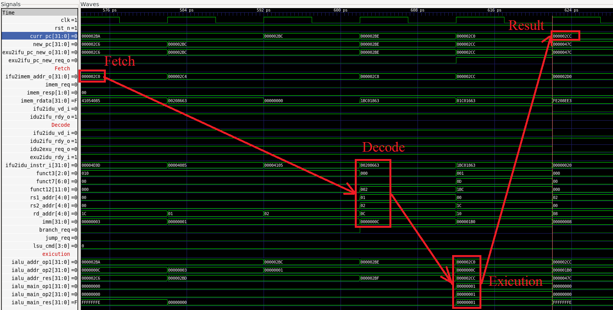

# Отчет о лабораторной работе №3

## Цель работы
Познакомиться с архитектурой пайплайна SCR1. Доработать тестбенч для вывода информации об микроархитектурном состоянии и состоянии конвеера при выполении определенной команды.

## Вариант задания

| Номер варианта | ФИО                | Исследуемая команда | Отладочная информация |
|----------------|--------------------|---------------------|-----------------------|
| 12             | Даниил Симоновский | beq                 | Вывести значения атрибутов команды            |

## Ход работы

Необходимо проанализировать работу команды `beq` в пайплайне процессора. Доработать тестовое окружение таким образом, чтобы при выполнении команды `beq` в терминал выводилось сообщение "detected BEQ command" и значения атрибутов.

### Конфигурация тестов

Сначала отредактируем список тестов, которые должны запускаться в файле `rv32_tests.inc`:

```
ARCH_lowercase = $(shell echo $(ARCH) | tr A-Z a-z)

rv32_isa_tests += isa/rv32mi/beq.S
```

Для запуска тестов с формированием временной диаграммы воспользуемся следующей командой:

```
make run_verilator_wf TARGETS="riscv_isa" TRACE=1
```

Важно отметить, что для запуска тестов с предоставленным тулчейном необходимо было отредактировать `Makefile` для компиляции теста следующим образом:

```
CFLAGS := -I$(inc_dir) -I$(src_dir) -DASM -Wa,-march=rv32$(ARCH) -march=rv32$(ARCH) -mabi=ilp32f -D__riscv_xlen=32
LDFLAGS := -static -fvisibility=hidden -nostdlib -nostartfiles -T$(inc_dir)/link.ld -march=rv32$(ARCH) -mabi=ilp32f
```

Изменения были во флагах компилятора, а именно в флаге `-march`, где было убрано расширение `_zifencei`, так как предоставленная версия тулчейна не поддерживает данное расширение, однако оно лишь выносит одну из команд из расширения I, а значит все будет работать корректно.

### Просмотр временной диаграммы 

С помощью программы `GTKWave` просмотрим сгенерированную временную диаграмму `simx.vcd`. Выведем сигналы:
* `clk` - тактовый импульс
* `curr_pc` - текущее значение счетчика команд, соответствует стадии Execution
* набор сигналов для Instruction Fetch:
  * `imem_req` - запрос от процессора в память инструкций
  * `imem_addr` - адрес запроса памяти инструкций
  * `imem_resp` - ответ памяти инструкций
  * `imem_rdata` - данные чтения памяти инструкций

* И другие сигналы, отражающие работу пайплайна. 

Будем смотреть выполнение инструкции  `2c0: 00208663 beq ra,sp,2cc <test_3+0x12>`.



Как можно увидеть, сначала загружается инструкция из памяти, затем через несколько тактов она декодируется, далее исполняется.

Здесь:

- `ifu2imem_addr_o` (Запрос) — адрес, который IFU отправляет в память инструкций (IMEM). Это адрес чтения 32-битного слова (обычно выровненный по 4), по которому запрашивается очередная порция кода. Один такой запрос может покрывать одну или две инструкции, либо часть инструкции в случае невыровненного PC.

- `imem_rdata` (Ответ памяти) — 32-битное слово, возвращённое памятью инструкций в ответ на один из предыдущих запросов `ifu2imem_addr_o`. Это сырые данные памяти, которые сами по себе ещё не являются инструкцией. IFU использует их как исходный материал для формирования инструкции (выбор halfword, определение длины инструкции, возможная склейка из двух слов).

- `ifu2idu_instr_i` (Инструкция для декодера) — готовая инструкция, сформированная IFU из одного или двух значений `imem_rdata` и переданная в блок декодирования (IDU). Именно это значение далее декодируется и исполняется процессором.

- `funct3`, `rs1_addr`, `rs2_addr`, `imm` (Результат декодирования) — поля инструкции, извлечённые в IDU:
  - `funct3` определяет конкретный тип операции (для ветвлений — BEQ/BNE и т.д.),
  - `rs1_addr`, `rs2_addr` указывают номера регистров-операндов,
  - `imm` содержит знаковое смещение перехода.
  Совокупность этих сигналов полностью описывает семантику инструкции.

- `branch_req` (Признак ветвления) — флаг, выставляемый декодером, который указывает, что текущая инструкция является инструкцией ветвления и в стадии исполнения необходимо выполнить сравнение регистров и вычисление целевого адреса перехода.

- `ialu_addr_op1`, `ialu_addr_op2`, `ialu_addr_res` (Расчёт адреса перехода) — сигналы исполнительного блока (EXU), используемые для вычисления целевого адреса ветки:
  - `ialu_addr_op1` — текущий PC инструкции,
  - `ialu_addr_op2` — смещение `imm`,
  - `ialu_addr_res` — результат сложения `PC + imm`, то есть адрес перехода.

- `ialu_main_op1`, `ialu_main_op2`, `ialu_main_res` (Проверка условия ветвления) — сигналы сравнения операндов ветвления:
  - `ialu_main_op1` и `ialu_main_op2` — значения регистров `rs1` и `rs2`,
  - `ialu_main_res` — результат сравнения (для BEQ равен 1, если операнды равны).

- `new_pc` (Результат выполнения) — новое значение счётчика команд, сформированное в EXU. Если условие ветвления выполнено, сюда передаётся вычисленный адрес перехода; это значение используется IFU для перенаправления дальнейшей выборки инструкций.

### Несинтезируемый блок

Далее переходим в директорию `src/tb/` и создаем несинтезируемый блок, который будет нам выводить информацию об атрибутах, когда из памяти грузится инструкция `beq`. Блок будет иметь следующий вид:

```verilog
module scr1_tb_log_cmd();

  always_ff @(posedge scr1_top_tb_ahb.i_top.i_imem_ahb.clk) begin
    if (scr1_top_tb_ahb.i_top.i_imem_ahb.imem_resp == 2'b01) begin
      // valid data from AHB router
      if (
        (scr1_top_tb_ahb.i_top.i_imem_ahb.imem_rdata[6  : 0]  == 7'b1100011) && // opcode for branches (BEQ/BNE/...)
        (scr1_top_tb_ahb.i_top.i_imem_ahb.imem_rdata[14 : 12] == 3'b000)        // funct3 for BEQ
      ) begin
        // detect BEQ command
        $display("BEQ: opcode=%b funct3=%b rs1=%b rs2=%b imm[12]=%b imm[11]=%b imm[10:5]=%b imm[4:1]=%b (imm[0]=0)",
          scr1_top_tb_ahb.i_top.i_imem_ahb.imem_rdata[6:0],
          scr1_top_tb_ahb.i_top.i_imem_ahb.imem_rdata[14:12],
          scr1_top_tb_ahb.i_top.i_imem_ahb.imem_rdata[19:15],
          scr1_top_tb_ahb.i_top.i_imem_ahb.imem_rdata[24:20],
          scr1_top_tb_ahb.i_top.i_imem_ahb.imem_rdata[31],
          scr1_top_tb_ahb.i_top.i_imem_ahb.imem_rdata[7],
          scr1_top_tb_ahb.i_top.i_imem_ahb.imem_rdata[30:25],
          scr1_top_tb_ahb.i_top.i_imem_ahb.imem_rdata[11:8],
        );
      end
    end
  end

endmodule
```

Здесь мы проверяем загружаемую инструкцию на наличие операционного кода, соответсвующего команде `beq`. При нахождении мы выводим сообщение о том, что обнаружили инструкцию и рядом мы выводим значение атрибутов. 

Затем мы перекомпилируем проект и попробуем его запустить. После запуска мы получаем следующий вывод:

```
scr1_top_tb_ahb
---Test:                          beq.hex
BEQ: opcode=1100011 funct3=000 rs1=00101 rs2=00000 imm[12]=0 imm[11]=0 imm[10:5]=000000 imm[4:1]=1101 (imm[0]=0) 
BEQ: opcode=1100011 funct3=000 rs1=00001 rs2=00010 imm[12]=0 imm[11]=0 imm[10:5]=000000 imm[4:1]=0110 (imm[0]=0) 
BEQ: opcode=1100011 funct3=000 rs1=00001 rs2=00010 imm[12]=1 imm[11]=1 imm[10:5]=111111 imm[4:1]=1110 (imm[0]=0) 
BEQ: opcode=1100011 funct3=000 rs1=00001 rs2=00010 imm[12]=1 imm[11]=1 imm[10:5]=111111 imm[4:1]=1110 (imm[0]=0) 
BEQ: opcode=1100011 funct3=000 rs1=00001 rs2=00010 imm[12]=0 imm[11]=0 imm[10:5]=000000 imm[4:1]=0100 (imm[0]=0) 
BEQ: opcode=1100011 funct3=000 rs1=00001 rs2=00010 imm[12]=1 imm[11]=1 imm[10:5]=111111 imm[4:1]=1110 (imm[0]=0) 
BEQ: opcode=1100011 funct3=000 rs1=00001 rs2=00010 imm[12]=1 imm[11]=1 imm[10:5]=111111 imm[4:1]=1110 (imm[0]=0) 
BEQ: opcode=1100011 funct3=000 rs1=00001 rs2=00010 imm[12]=0 imm[11]=0 imm[10:5]=000000 imm[4:1]=0100 (imm[0]=0) 
BEQ: opcode=1100011 funct3=000 rs1=00001 rs2=00010 imm[12]=1 imm[11]=1 imm[10:5]=111111 imm[4:1]=1110 (imm[0]=0) 
BEQ: opcode=1100011 funct3=000 rs1=00001 rs2=00010 imm[12]=1 imm[11]=1 imm[10:5]=111111 imm[4:1]=1110 (imm[0]=0) 
BEQ: opcode=1100011 funct3=000 rs1=00001 rs2=00010 imm[12]=0 imm[11]=0 imm[10:5]=001000 imm[4:1]=1000 (imm[0]=0) 
BEQ: opcode=1100011 funct3=000 rs1=00001 rs2=00010 imm[12]=0 imm[11]=0 imm[10:5]=001000 imm[4:1]=1000 (imm[0]=0) 
BEQ: opcode=1100011 funct3=000 rs1=00001 rs2=00010 imm[12]=0 imm[11]=0 imm[10:5]=000111 imm[4:1]=1100 (imm[0]=0) 
BEQ: opcode=1100011 funct3=000 rs1=00001 rs2=00010 imm[12]=0 imm[11]=0 imm[10:5]=000111 imm[4:1]=1100 (imm[0]=0) 
BEQ: opcode=1100011 funct3=000 rs1=00001 rs2=00010 imm[12]=0 imm[11]=0 imm[10:5]=000100 imm[4:1]=0100 (imm[0]=0) 
BEQ: opcode=1100011 funct3=000 rs1=00001 rs2=00010 imm[12]=0 imm[11]=0 imm[10:5]=000100 imm[4:1]=0100 (imm[0]=0) 
BEQ: opcode=1100011 funct3=000 rs1=00001 rs2=00010 imm[12]=0 imm[11]=0 imm[10:5]=000011 imm[4:1]=1000 (imm[0]=0) 
BEQ: opcode=1100011 funct3=000 rs1=00001 rs2=00010 imm[12]=0 imm[11]=0 imm[10:5]=000011 imm[4:1]=1000 (imm[0]=0) 
BEQ: opcode=1100011 funct3=000 rs1=00000 rs2=00000 imm[12]=0 imm[11]=0 imm[10:5]=000000 imm[4:1]=0110 (imm[0]=0) 
BEQ: opcode=1100011 funct3=000 rs1=00000 rs2=00000 imm[12]=0 imm[11]=0 imm[10:5]=000000 imm[4:1]=0110 (imm[0]=0) 
BEQ: opcode=1100011 funct3=000 rs1=01110 rs2=01111 imm[12]=0 imm[11]=0 imm[10:5]=000000 imm[4:1]=1111 (imm[0]=0) 
Test passed

#--------------------------------------
# Summary: 1/1 tests passed
#--------------------------------------

- /mnt/c/Users/User/Downloads/lab_scr1/src/tb/scr1_top_tb_runtests.sv:199: Verilog $finish
```

Из сообщения можно сделать вывод, что написанный блок корректно находит команду `beq` и выводит значение атрибутов.

## Вывод

Данная работа позволила подробно изучить, как работает пайплайн в проекте SCR1.
